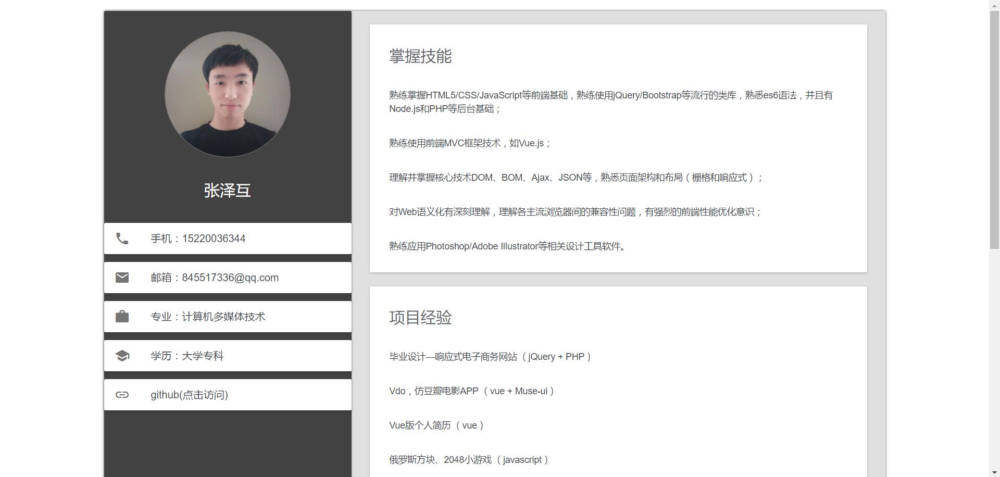
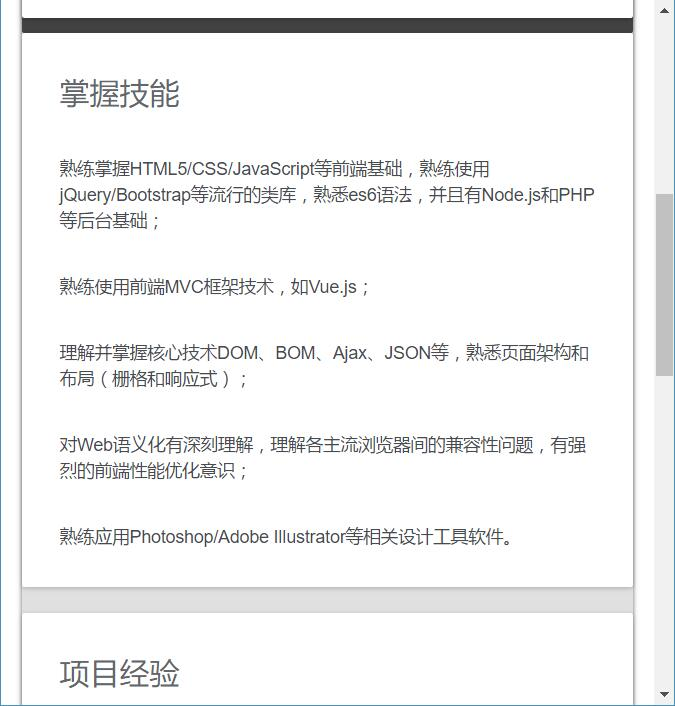

# 个人简历

> A Vue.js project

[预览](https://cheungzehu.github.io/Cheung-resume/)

## 快速使用

``` bash
# 克隆项目到本地
https://github.com/CheungZehu/Cheung-resume

# 安装依赖
npm install

# 在 localhost:8080 启动项目
npm run dev

```

## 截图





